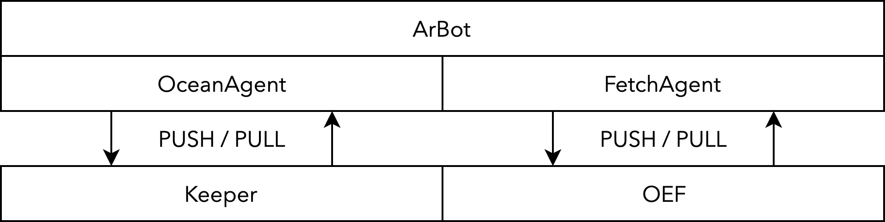

<p align="center">
    
    <br><br>
    Arb datasets between data marketplaces.<br>
    Bridges Fetch.AI and Ocean Protocol.<br><br>
    <i>An app in the Convergence Stack.</i>
</p>

## Components

1. FetchAgent / OceanAgent: push / pull data agents, allowing data onboarding from Fetch to Ocean and vice versa.
2. ArBot: Automated triangular arbitrage with Fetch.AI tokens, Ocean tokens and data. The software executes in cases where the highest bidder on Fetch pays more than the lowest cost of the dataset on Ocean and vice versa.

<p align="center">
    
</p>

## Requirements

- Linux or MacOS
- Docker
- Latest `protobuf`: install binary [from source](https://github.com/protocolbuffers/protobuf/releases)

## Install

```
pip3 install .
```

## Usage

You will need a running Fetch.AI and Ocean Protocol node. If you don't want to set these up yourself:
```
cd nodes
```
Then use any of the following as appropriate:
```
./get_nodes.sh
./start_nodes.sh
./stop_nodes.sh
./delete_nodes.sh
```
These need to be run from the `nodes` folder.

**Note that for publishing on Ocean, which is a requirement of the data arbitrage component, you will need to host your own data. This means spinning up a webserver with a publicly accessible URL - see any function arguments marked URL. The simplest solution is a [plain nginx server](https://nginxconfig.io/?0.index=index.html&0.fallback_html), hosting any datasets at the top level.**

**Also note that Fetch-side publishing demands JSON-formatted sets, but the node will handle hosting and data transfer for you.**

Once nodes are running, test your install from the root folder:
```
pytest
```

### Ocean Protocol to Fetch.AI

```python
from dlm.ocean import OceanAgent
from dlm.fetch import FetchAgent

oa = OceanAgent('/path/to/ocean/config.ini')
results = oa.ocean_search('flowers')
first_result_ddo = results[0]['ids']['ddo']
path_to_data, _ = oa.ocean_consume(first_result_ddo)

fa = FetchAgent()
fa.connect()
fa.fetch_publish_from_ocean_meta(metadata = oa.ocean_get_meta_from_ddo(first_result_ddo),
                                 price = 0,
                                 load_path = path_to_data)
try:
    fa.run()
finally:
    fa.stop()
    fa.disconnect()
```

### Fetch.AI to Ocean Protocol

```python
from dlm.fetch import FetchAgent
from dlm.ocean import OceanAgent

fa = FetchAgent()
fa.connect()
fa.fetch_search('flowers')
search_results = fa.fetch_get_search_results()
fa.fetch_consume(number_to_consume = 1, save_path = './')
try:
    fa.run()
finally:
    fa.stop()
    fa.disconnect()

oa = OceanAgent('/path/to/ocean/config.ini')
oa.ocean_publish(name = 'Iris Dataset',
                 description = 'Multivariate Iris flower dataset for linear discriminant analysis.',
                 price = 0,
                 url = 'https://mywebserverurl.io/iris.json',
                 license = 'CCO: Public Domain',
                 tags = ['flowers', 'classification', 'plants'])
```


### Arbitrage

```python
from dlm.arbot import ArBot

ab = ArBot('/path/to/ocean/config.ini', '/path/to/webserver/root', 'https://yourhosting.url')
ab.arb('iris categorical')
```

### Managing arbitrage risk with specificity

The key parameter for executing execution risk in data arbitrage is specificity. By limiting ArBot’s search space, we get stronger guarantees that the consumer it is selling to is receiving what they expect. Thus, specificity allows users of ArBot to choose their own appetite for risk. At low levels of specificity, there is a high risk that the consumer will reject the dataset offering, but there are far more opportunities available. At high levels of specificity, there are fewer opportunities, but the consumer is much more likely to buy.

An example of a high-risk strategy for ArBot is feeding it the query ‘daffodil flowers.’ There may be a seller of data labelled daffodil flowers on Ocean Protocol and a buyer looking for daffodil flowers on Fetch.AI, however their uses for the data might be different. The seller could be in possession of art, and the buyer may want to train their flower-identifying AI with many pictures of daffodils. In this case, provided the seller’s price is lower than the buyer’s (factoring in network fees), ArBot will take the risk of the buyer not wanting to follow through with the transaction. The benefit of this strategy, however, is that there will likely be a multitude of results for the query daffodil flowers, many of which will result in successful arbitrage.

In contrast, a low-risk strategy would be to feed ArBot the query ‘1000 daffodil flowers classification AI dataset.’ In this case, there will likely be few results, however the buyer and seller likely refer to the exact same thing. With a low-risk strategy, the probability of failed arbitrage is low.


### Examples

See the `demo` folder for some super simple examples.

For a full Ocean -> Fetch -> Ocean flow:

Terminal 1:
```
python3 o2f.py
```
Terminal 2:
```
python3 f2o.py
```

### Specifying mainnet / testnet / local deployment

By default all components will run locally.

Use the environment variable `NET`, setting it to `TEST` or `MAIN` as needed.


## Debugging

Run `pytest` with both nodes running to test.

`secret_store_client.client.RPCError: Failed to generate server key: Bad Gateway`: the Ocean node is still spinning up. Wait a few minutes.

`requests.exceptions.ConnectionError: HTTPConnectionPool(host='localhost', port=8545): Max retries exceeded with url`: as above.

`struct.error: unpack requires a buffer of 4 bytes`: Intermittent OEF issue - restart your OEF node. If using the included scripts:
```
cd nodes
./stop_nodes.sh
./start_nodes.sh
```

