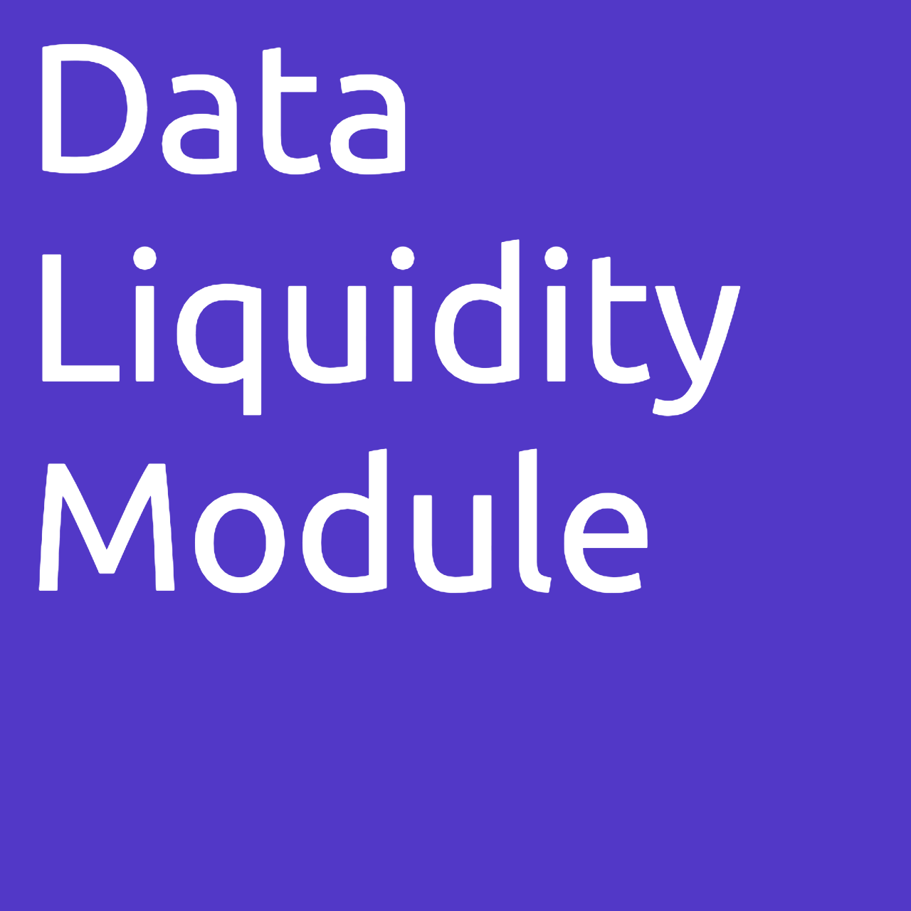
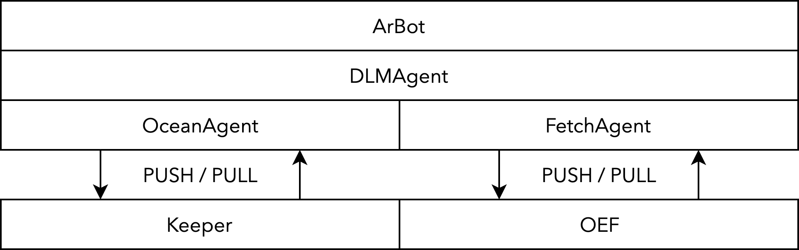

<p align="center">
    
    <br><br>
    The Data Liquidity Module (DLM) facilitates Web 3.0<br>
    data liquidity with Fetch.AI and Ocean Protocol.<br><br>
    <i>An app in the Convergence Stack.</i>
</p>


## Usage

You will need a running Fetch.AI and Ocean Protocol node. If you don't want to set these up yourself:
```
cd nodes
```
Then use any of the following as appropriate:
```
./get_nodes.sh
./start_nodes.sh
./stop_nodes.sh
```
These need to be run from the `nodes` folder.


## Components

1. DLMAgent: Data onboarding from Ocean to Fetch at a small surcharge to cover the computation cost.
2. ArBot: Automated triangular arbitrage with Fetch.AI tokens, Ocean tokens and data. The software would execute in cases where the highest bidder on Fetch pays more than the lowest cost of the dataset on Ocean.

<p align="center">
    
</p>

## Overview

Ocean Protocol harbours useful data. Fetch.AI routes data to those who need it. The DLM represents an Ocean dataset with a Fetch agent, which would carry it to where it would be of most use.

The software scans the demand for datasets on Fetch, looking for matches in Ocean datasets to bring to the OEF. 

For free datasets on Ocean, the DLM offers these at a small cost (to cover computation) on Fetch.

For paid datasets, the DLM executes in cases where the cost of the dataset in Ocean tokens is less than the value of the dataset in Fetch tokens, relative to a baseline currency (e.g. USD) – this prevents the software from being loss-making. Again, a small surcharge would be levied.

A form of triangular arbitrage will also be implemented as a separate module: the software will identify the lowest-cost instance of a particular dataset or class of data on Ocean Protocol and the highest bidder for that same data on Fetch.

To encourage data liquidity in the Convergence Stack, the DLM offers select datasets where there is no known demand on Fetch. Selection criteria is derived from Ocean's curation mechanisms, only looking at free datasets to gauge potential for use on Fetch.

Different hosts of the DLM will likely be competing to execute the data arbitrage opportunities. More successful instances would be characterised by fast execution speed and an improved matching engine.

